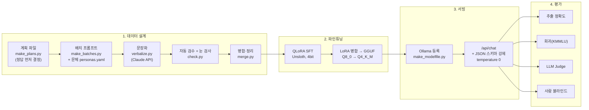
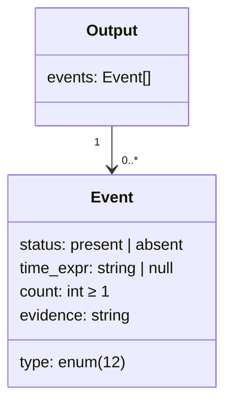
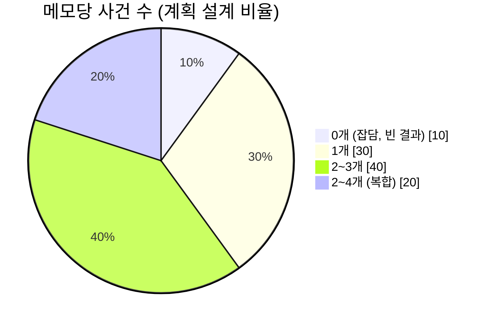
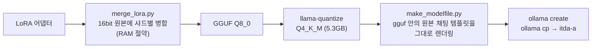
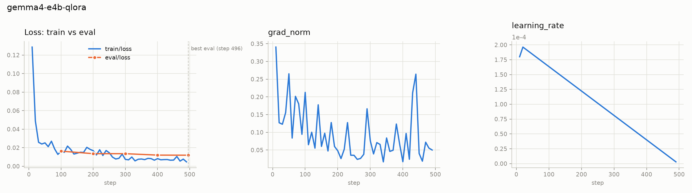
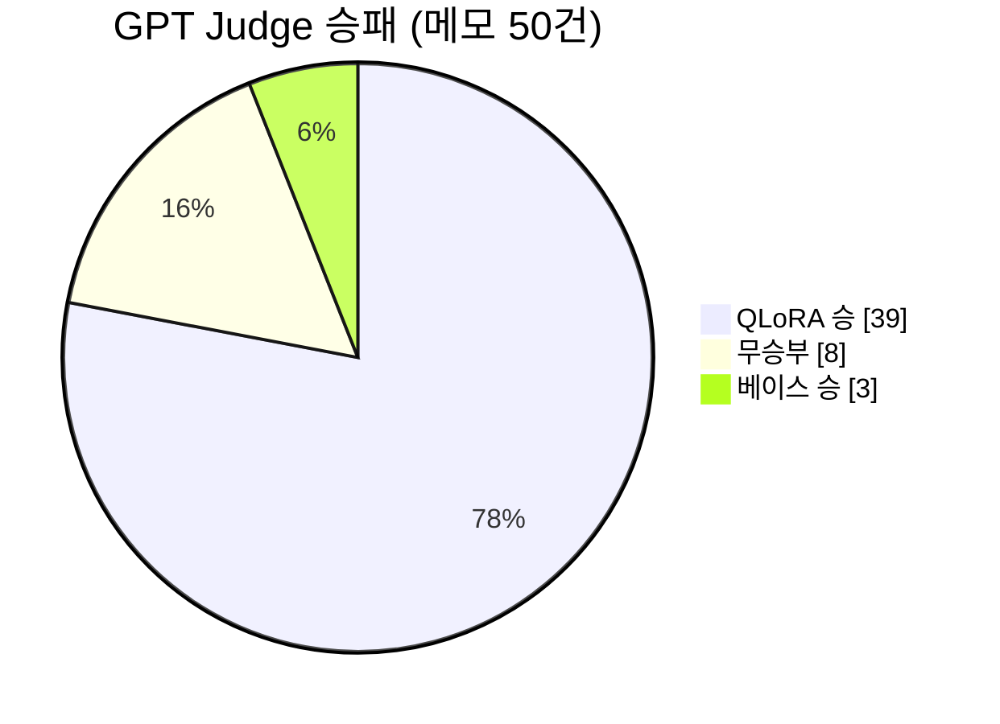
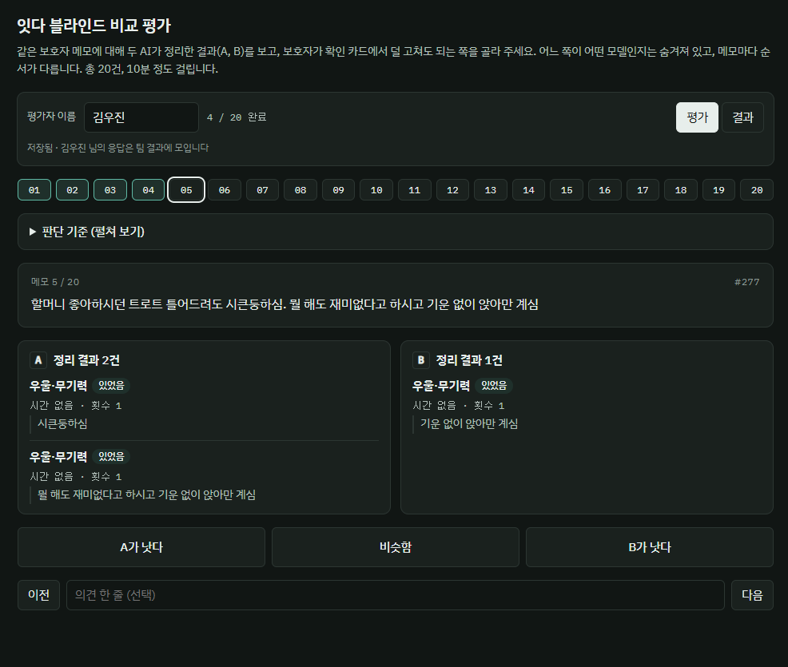
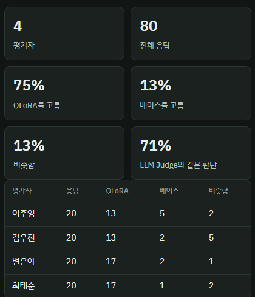

# itda-ai

치매 환자 보호자가 쓴 **자유 형식 관찰 메모**에서 증상 사건을 뽑아 **정해진 JSON**으로 바꾸는 소형 LLM(모델 A, `itda-a`)의 데이터·학습·평가 레포.

```
입력  "어젯밤 두 시쯤 깨셔서 한참 거실 왔다갔다 하심. 저녁 약은 안 드신다고 버티심."

출력  {"events": [
        {"type": "night_waking",       "status": "present", "time_expr": "어젯밤", "count": 1, "evidence": "어젯밤 두 시쯤 깨셔서"},
        {"type": "wandering_exit",     "status": "present", "time_expr": "어젯밤", "count": 1, "evidence": "한참 거실 왔다갔다 하심"},
        {"type": "medication_refusal", "status": "present", "time_expr": null,     "count": 1, "evidence": "저녁 약은 안 드신다고 버티심"}
      ]}
```

## 한눈에 보기

| 항목 | 내용 |
|---|---|
| 서비스 모델 | **Gemma 4 E4B + QLoRA → GGUF Q4_K_M** (`itda-gemma4-e4b:q4_k_m` = `itda-a`), Ollama로 로컬 서빙 |
| 학습 데이터 | Claude로 만든 합성 메모 **train 1,977 / val 200 / 평가 300** (문체 13종, 유형 12종 균형) |
| 추출 성능 (평가 300건) | F1 **0.857 → 0.986**, 메모 완전일치 **65% → 95%** (베이스와 같은 조건) |
| 기존 능력 | 일반 질문+KMMLU 80문항 70.0% → 68.8% (**−1.2%p**, 허용 기준 3%p 이내) |
| 사람·LLM 평가 | 블라인드 비교에서 사람 **75%**, GPT Judge **78%** 가 QLoRA 선택 |
| 처리 시간 | GPU(RTX 4060 Laptop) 1.6초/건, CPU만 7.8초/건 |

## 전체 흐름



---

## 1. 데이터 모델링

### 1-1. 출력 스키마

모델이 내는 JSON은 [config/event_schema.json](config/event_schema.json)으로 고정하고, 서빙 때 Ollama `format`에 그대로 넣어 강제함.



| 필드 | 규칙 | 설계 의도 |
|---|---|---|
| `type` | 12개 코드 중 하나 | 자유 텍스트 대신 닫힌 목록 → 집계·추이 계산 가능 |
| `status` | `present` / `absent`. absent는 **명시적 부정**일 때만 | "오늘은 배회 없었음" 같은 음성 정보도 기록으로 남김 |
| `time_expr` | 메모의 시간 표현을 **그대로** ("어젯밤"), 없으면 null | 날짜 계산은 모델이 아닌 백엔드 규칙으로 (모델 환각 차단) |
| `count` | 언급 없으면 1 | |
| `evidence` | 메모 구절을 **고치지 않고** 복사 | 보호자가 확인 카드에서 근거를 바로 대조. 평가 때 원문 포함 여부 자동 검사 |

필드 순서(`type → status → time_expr → count → evidence`)도 학습의 일부임. 순서가 바뀌면 성능이 떨어지는 모델이 있음 ([4-4](#4-4-발견-사항) 참고).

### 1-2. 증상 유형 12종

[config/labels.json](config/labels.json)

| 코드 | 라벨 | 코드 | 라벨 |
|---|---|---|---|
| `night_waking` | 야간 각성 | `delusion` | 망상 |
| `wandering_exit` | 배회·출입문 시도 | `hallucination` | 환각 |
| `agitation` | 초조·공격 | `reduced_intake` | 식사량 감소 |
| `irritability` | 과민·짜증 | `medication_refusal` | 복약 거부 |
| `anxiety` | 불안 | `confusion` | 사람·장소 혼동 |
| `low_mood_apathy` | 우울·무기력 | `fall` | 낙상 |

### 1-3. 라벨링 규칙 (경계 사례)

실제 메모에서 헷갈리는 경우를 규칙으로 정해 [config/system_prompt.txt](config/system_prompt.txt)와 데이터에 똑같이 반영함. 결정 이력은 [docs/decisions.md](docs/decisions.md).

| 상황 | 처리 |
|---|---|
| 밤에 깨서 돌아다님 | `night_waking` + `wandering_exit` **둘 다** |
| 짜증 + 소리 지르기·밀치기 | `irritability` + `agitation` **둘 다** |
| "저녁은 반 공기 드심" (양만 적음) | 출력 안 함. "평소보다", "~밖에" 같은 **줄었다는 표현**이 있어야 식사량 감소 |
| "부스럭거리셨나?" (의문형) | 출력 안 함. "~것 같음"(추측)은 present |
| 반복 질문, 실금, 낮잠 (목록 밖) | 가까운 유형에 **억지로 넣지 않음** |
| 정상 복용, 깜빡 누락 | 출력 안 함 (거부만 해당) |
| 보호자 자신의 상태, 의사 말, 옛날 회상 | 출력 안 함 |
| "자다 깸" | 낮이라고 안 쓰면 야간 각성 |

---

## 2. 합성 데이터 생성

실제 보호자 메모는 개인정보라 모을 수 없어, **정답을 먼저 정하고 문장을 나중에 만드는** 방식으로 합성함.

### 2-1. 정답 먼저 (계획 파일)

[make_plans.py](ml/data_gen/make_plans.py)가 메모마다 담을 사건 목록을 먼저 뽑음. Claude는 이 계획을 문장으로 바꾸기만 하므로 **라벨이 틀릴 여지가 구조적으로 작음**.



- **유형 균형**: 적게 나온 유형에 가중치 3배 → 슬롯마다 12유형이 거의 같은 수 (S1 기준 79~83건)
- **부정(absent)** 12%, **시간 표현** 35%, **횟수** 1~3
- **방해 요소(distractor)** 20%: 반복 질문, 실금, 낮잠, 양만 적힌 식사, 의문문, 보호자 하소연, 정상 복용 등 → "뽑지 말아야 할 것"을 학습
- 목표보다 20% 넉넉히 생성해 검수 탈락분을 채움

### 2-2. 문체 13종 (personas.yaml)

[personas.yaml](ml/data_gen/personas.yaml)에 관계·말투·길이·습관·오타 수준을 정의함. **학습·검증·평가 문체를 완전히 분리**해 평가가 "본 적 없는 문체"에 대한 일반화를 재도록 함.

| 용도 | 문체 | 예 |
|---|---|---|
| 학습 (T01~T10) | 50대 딸 메모체, 40대 아들 반말, 70대 아내 구어체(오타 많음), 30대 딸 "ㅠㅠ", 60대 아들 보고서체 … | "영감이 그저께 밤에 화장실 가다 넘어질뻔 햇는데…" |
| 검증 (V01) | 학습과 다른 문체 | |
| 평가 (E01, E02) | 학습과 다른 문체 (사투리 포함) | "약 묵으라 카니 안 묵는다꼬 손으로 밀어내삤다 아이가." |

### 2-3. 2단계 검수

| 단계 | 방법 | 도구 |
|---|---|---|
| 자동 검수 | 근거 개수 = 사건 개수, 근거가 메모에 **글자 그대로** 있는지, 시간 표현 포함, 식사량 감소에 "줄었다" 표현 포함 | [check.py](ml/data_gen/check.py) |
| 눈 검사 | 슬롯마다 50건 사람이 판정 (평가 세트 W_test는 **300건 전수**) | `check.py --review` |
| 정리 | 눈 검사 오류, 라벨 규칙 불일치 건 제거 (S3 23건, W_test 1건 등) | [merge.py](ml/data_gen/merge.py) |

### 2-4. 최종 데이터

| 세트 | 건수 | 문체 | 용도 |
|---|---|---|---|
| `ml/data/train.jsonl` | 1,977 | T01~T10 | 학습 |
| `ml/data/val.jsonl` | 200 | V01 | eval loss, 체크포인트 선택 |
| `ml/data/synth_eval.jsonl` | 300 | E01, E02 | **최종 평가 (학습 미사용, 전수 검수)** |

유형별 사건 수 297~316건, 빈 결과 비율 10.3%.

---

## 3. 파인튜닝 설계

### 3-1. 모델 선택 기준

보호자 기록은 민감 정보라 **외부 API로 보내지 않고 로컬(Ollama)에서 돌릴 수 있는 4B급 이하**를 후보로 함. 후보 5종을 같은 데이터·같은 방식으로 학습해 비교.

| 후보 | 결과 |
|---|---|
| **Gemma 4 E4B** | **선택.** 서비스 조건(스키마 강제)에서 F1 최고, 스키마 강제해도 필드 순서 유지 |
| Gemma 3 4B | F1 0.964 |
| Qwen (Q4_K_M) | F1 0.972, 스키마 강제 시 필드 순서가 알파벳순으로 바뀌어 하락 |
| EXAONE 4.0 1.2B | 가장 빠르나 Ollama `/api/chat`에서 학습 템플릿이 재현되지 않음, 비상업 라이선스 |

### 3-2. 학습 설정

[ml/train/itda_train_E4B_local.ipynb](ml/train/itda_train_E4B_local.ipynb) (RTX 4070 Ti 12GB, WSL)

| 항목 | 값 | 이유 |
|---|---|---|
| 방식 | QLoRA (4bit 베이스 + LoRA), Unsloth | 12GB GPU 한 장으로 학습 |
| LoRA | r 16, alpha 16, dropout 0, 어텐션+MLP 전체 | 텍스트 전용(`text_only`), 비전 층 제외 |
| 손실 대상 | **JSON 답 부분만** (`train_on_responses_only`) | 시스템 프롬프트·메모를 외우지 않고 추출만 학습 |
| 시퀀스 길이 | 1,024 | |
| 배치 | 1 × 누적 8 = 실효 8 | |
| 에폭 / 스텝 | 2 / 약 494 | |
| 학습률 | 2e-4, warmup 10, 선형 감소, adamw_8bit | |
| 체크포인트 | 100스텝마다 val loss로 **최저점 선택** | |
| 메모리 절약 | 층별 임베딩(PLE)을 CPU로 옮김 | 학습하지 않는 조회용 표라 GPU에서 빼도 무방 |

### 3-3. 학습 → 서빙



- 모델을 바꿀 때는 `ollama cp <모델> itda-a` 한 줄. 백엔드 설정은 건드리지 않음
- Modelfile을 손으로 쓰지 않고 gguf의 jinja 템플릿에서 만들어 **학습 때와 같은 프롬프트**를 보장
- Q8_0 대비 F1 차이 0.003, 크기 8.0GB → 5.3GB, CPU 최대 처리 시간 30초 → 20초라 Q4_K_M 채택

---

## 4. 평가

네 가지 질문으로 나눠 평가함. 상세: [docs/모델평가_4질문_0929.md](docs/모델평가_4질문_0929.md)

| 질문 | 방법 | 결과 |
|---|---|---|
| ① 학습은 안정적인가 | W&B 학습 곡선 | 과적합·발산 없음 |
| ② 목표 능력이 생겼는가 | 평가 300건, 베이스와 같은 조건 | F1 0.857 → **0.986** |
| ③ 기존 능력은 유지되는가 | 일반 질문 30 + KMMLU 50 | −1.2%p (기준 3%p 이내) |
| ④ 사람이 보아도 좋은가 | GPT Judge + 팀원 블라인드 평가 | QLoRA 선호 78% / 75% |

### 4-1. 학습 안정성 (W&B)



- train loss 0.129 → 0.005, eval loss 0.0163 → 0.0119 (최저점 = 마지막 스텝 496)
- grad_norm 최대 0.34, NaN 0건, 기울기 자르기 기준(1.0)에 닿은 적 없음
- 2에폭 이후 train이 eval보다 낮아지는 구간이라 2에폭에서 멈춘 것이 적절

### 4-2. 추출 정확도 (베이스 vs QLoRA, 같은 조건)

정답 판정: 같은 메모 안에서 `type`과 `status`가 같으면 맞은 사건. Ollama, Q4_K_M, temperature 0, 생각 모드 끔, 스키마 강제.

| 지표 | 베이스 | QLoRA |
|---|---|---|
| **F1** | 0.857 | **0.986** |
| 정밀도 / 재현율 | 0.890 / 0.827 | 0.979 / 0.993 |
| **메모 완전일치** | 0.653 | **0.953** |
| 시간 표현 일치 | 0.825 | 0.971 |
| 근거가 원문에 있음 | 0.973 | 1.000 |
| 빈 결과 정확 | 0.914 | 0.943 |
| JSON 통과 | 1.0 | 1.0 |

유형별 F1 — 베이스에서 약했던 과민·짜증(0.74), 사람·장소 혼동(0.79)이 가장 크게 오름.

```mermaid
xychart-beta
    title "유형별 F1: 베이스(아래) vs QLoRA(위)"
    x-axis ["야간각성", "배회", "초조공격", "과민짜증", "불안", "우울", "망상", "환각", "식사감소", "복약거부", "혼동", "낙상"]
    y-axis "F1" 0.7 --> 1.0
    bar [1.0, 0.968, 0.979, 0.989, 0.969, 0.968, 1.0, 1.0, 0.979, 0.99, 0.989, 1.0]
    bar [0.882, 0.84, 0.905, 0.736, 0.857, 0.861, 0.818, 0.857, 0.896, 0.957, 0.785, 0.907]
```



후보 모델 비교 (파인튜닝 후, 서비스 조건). 전체 표: [ml/eval/results/compare.md](ml/eval/results/compare.md)

| 모델 | F1 | 메모 완전일치 | GPU 초/건 | CPU 초/건 (평균/최대) |
|---|---|---|---|---|
| **Gemma 4 E4B Q4_K_M** | **0.9858** | 0.9533 | 1.60 | 7.75 / 20.45 |
| Gemma 4 E4B Q8_0 | 0.9884 | 0.9633 | 2.24 | 11.60 / 29.89 |
| Qwen Q4_K_M | 0.9716 | 0.9167 | 1.33 | 7.21 / 18.20 |
| Gemma 3 4B Q4_K_M | 0.9639 | 0.9000 | 1.45 | 10.08 / 15.72 |
| EXAONE 4.0 1.2B Q8_0 (raw 호출) | 0.9628 | 0.9000 | 0.68 | 미측정 |

### 4-3. 기존 능력 유지 (회귀 평가)

| 세트 | 베이스 | QLoRA |
|---|---|---|
| 일반 질문 30 (상식·계산·어휘·독해·돌봄) | 100% | 100% |
| KMMLU 50 (한국사·심리·보건·교육·사회복지) | 52% | 50% |
| **전체 80** | **70.0%** | **68.8%** |
| 일반 질문에 추출 JSON으로 답한 비율 | 0% | 0% |

추출 전용으로 학습했어도 일반 질문에 JSON으로 답하는 "모드 고착"이 없음. KMMLU 50문항은 오차가 약 ±14%p라 차이 없음으로 봄.

### 4-4. 사람이 보아도 좋은가

**LLM Judge** — gpt-5-mini, 블라인드 쌍대 비교, A/B 순서를 바꿔 2회 판정 ([judge_summary.md](ml/eval/results/judge/judge_summary.md))



| 기준 (1~5) | 베이스 | QLoRA |
|---|---|---|
| 정확성 | 4.24 | 4.91 |
| 완전성 | 4.09 | 4.90 |
| 규칙 준수 | 4.57 | 4.84 |
| 필드 정확성 | 3.57 | **4.88** |
| 근거 충실도 | 4.39 | 4.87 |

**사람 블라인드 평가** — 팀원 4명 × 20건. 두 결과 중 "보호자가 확인 카드에서 덜 고쳐도 되는 쪽"을 고름 (모델 이름 숨김, 순서 무작위)

<p>
  
  
</p>

- QLoRA 60(75%), 베이스 10(12.5%), 비슷함 10(12.5%) — 비슷함 제외 부호 검정 **p < 0.001**
- 메모별 다수결 QLoRA 17 / 비슷함 2 / 베이스 1, LLM Judge와 같은 판단 71%

### 4-5. 발견 사항

- **스키마 강제 시 필드 순서 문제**: Ollama `format`에 JSON 스키마를 넣으면 EXAONE·Qwen은 필드가 알파벳순(`count → evidence → …`)으로 강제되어 학습 순서와 달라지고 성능이 떨어짐. Gemma 계열은 순서가 유지됨 → 모델 선택의 결정적 근거
- **Ollama 템플릿 무시**: gguf에 jinja 템플릿이 든 일부 모델(EXAONE)은 Modelfile의 TEMPLATE을 무시하고 생각 모드가 켜진 채 등록됨 → F1 0.24. raw 호출 시 0.96
- **베이스는 `think: false` 필수**: 생각 모드를 켠 기본 설정이면 384토큰 안에 JSON을 못 냄(JSON 통과 13%)
- **목록 밖 관찰에서 짝 밀림**: 긴 메모에 목록 밖 행동("벽에 대변을 칠함")이 섞이면 근거와 유형의 짝이 한 칸씩 밀리는 사례. 사건 단위 채점에서는 1건 오류로만 보여 수작업 확인이 필요

---

## 5. 한계와 다음 과제

- **모든 수치는 합성 평가 세트 기준.** 문체는 분리했지만 학습 데이터와 같은 방식으로 만들어 점수가 부풀었을 수 있음 → 사람이 쓴 실제 메모 100건 평가 예정
- Judge·사람 평가 표본은 두 답이 다른 메모 위주라 승률이 전체 기준보다 높게 나옴
- 남은 약점: 목록 밖 관찰(반복 질문 → 식사량 감소로 오추출), 없었음 판별("다 드심"), 잡담 메모 35건 중 2건에서 사건 추출
- 모델 간 차이의 통계적 유의성(부트스트랩 신뢰구간) 미계산

---

## 환경 설정 (uv)

```bash
curl -LsSf https://astral.sh/uv/install.sh | sh   # uv 설치 (이미 있으면 생략)
uv sync                                           # .venv 생성 + uv.lock 기준 동기화
uv run python ml/data_gen/make_plans.py           # 스크립트 실행은 항상 uv run으로
```

새 패키지는 `uv add <패키지명>`으로 추가 (`pyproject.toml`, `uv.lock`이 함께 갱신됨). Python 3.12 이상. 학습(unsloth)과 GGUF 변환(llama.cpp)은 노트북·스크립트 안내대로 따로 설치.

## 디렉터리

```
config/
  labels.json            # 유형·상태 코드 → 한글 라벨
  event_schema.json      # 출력 JSON 스키마 (서빙 때 Ollama format으로 강제)
  system_prompt.txt      # 추출 모델 시스템 프롬프트 (라벨링 규칙 포함)
ml/data_gen/             # 합성 데이터 생성
  make_plans.py          #   정답 계획 생성 (S1~S4, W_val, W_test)
  personas.yaml          #   문체 13종 (T01~T10 학습, V01 검증, E01·E02 평가)
  make_batches.py        #   계획 + 문체 → 배치 프롬프트
  verbalize.py           #   Claude API로 문장화
  add_answer.py          #   채팅으로 받은 답 저장, --drop으로 제거
  check.py               #   자동 검수 + 눈 검사 판정
  merge.py               #   슬롯 병합 → ml/data/
  plans/, ok/            #   계획 파일, 검수 통과 결과·리포트
ml/data/                 # train 1,977 / val 200 / synth_eval 300
ml/train/                # 학습 노트북(E4B, EXAONE), merge_lora.py, log_to_wandb.py
ml/serve/                # make_modelfile.py (gguf 템플릿 → Ollama Modelfile)
ml/eval/                 # 평가
  eval_ollama.py         #   추출 정확도 (--cpu, --raw, 스키마 옵션)
  run_all.sh, compare.py #   등록 모델 전체 GPU/CPU 평가 → 비교표
  regression_eval.py     #   회귀 평가 (일반 질문 30 + KMMLU 50)
  judge_pairwise.py      #   GPT Judge 블라인드 쌍대 비교
  try_memo.py            #   메모 한 건 직접 넣어 보기
  results/               #   평가 결과 원본
ml/demo_gen/             # 데모 메모·사건, 변화 탐지 시나리오 생성
demo/                    # 데모 데이터 (demo/README.md)
docs/                    # 결정 기록, 평가 보고서
```

## 작업 흐름

**데이터**
1. `make_plans.py` — 슬롯별 계획 파일 생성 (`plans/`에 있으면 재실행 불필요)
2. `make_batches.py --slot <슬롯> --personas <문체목록> [--size N]`
3. `verbalize.py --slot <슬롯> --personas <문체목록> [--limit N] [--redo]`
   (채팅으로 받는 경우 `add_answer.py --slot <슬롯> [--file 경로] [--drop 번호,번호]`)
4. `check.py --slot <슬롯> --personas <문체목록> --target <목표건수> [--review N]`
5. `merge.py`

**학습·서빙**
1. `ml/train/itda_train_E4B_local.ipynb` 위에서부터 실행 → LoRA 저장
2. `merge_lora.py` → GGUF 변환 → `llama-quantize ... Q4_K_M`
3. `make_modelfile.py --gguf <파일> --out <Modelfile>` → `ollama create` → `ollama cp <모델> itda-a`

**평가**
```bash
bash ml/eval/run_all.sh && python ml/eval/compare.py     # 추출 정확도 (GPU 300 / CPU 50)
python ml/eval/regression_eval.py --models gemma4:e4b-it-q4_K_M itda-gemma4-e4b:q4_k_m   # 회귀 평가
python ml/eval/judge_pairwise.py \
  --base ml/eval/results/eval_base_gemma4-e4b_q4_k_m_gpu.json \
  --ft   ml/eval/results/eval_itda-gemma4-e4b_q4_k_m_gpu.json                         # LLM Judge
```

## 담당 배정 (데이터 v1.2)

| 담당 | 슬롯 | 문체 |
|---|---|---|
| 변은아 | S1 | T01, T07 |
| 최태순 | S2 | T02, T04 |
| 이주영 | S3 | T03, T10 |
| 조성률 | S4 | T05, T06 |
| 김우진 | W_val / W_test | V01 / E01, E02 |

자세한 개발 가이드는 [먼저읽기.txt](먼저읽기.txt)와 "잇다_상세개발가이드" 문서 참고.
